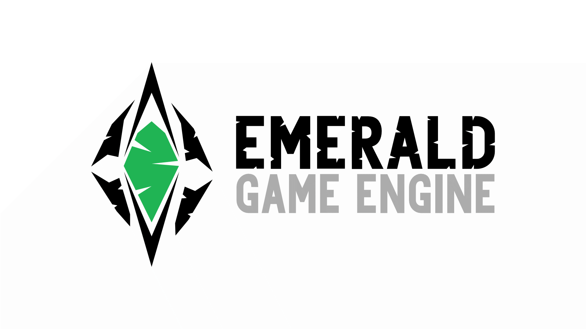
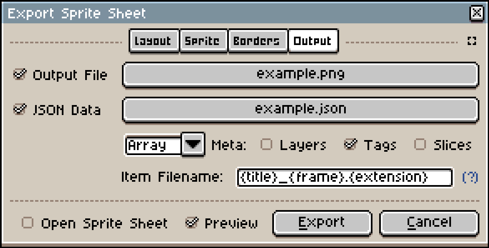

[](https://crates.io/crates/emerald)
[](https://travis-ci.com/Bombfuse/emerald)
[](https://opensource.org/licenses/MIT)

# Light and powerful

Emerald is designed to be as lightweight as possible, while remaining a fully-featured, cross-platform game engine.

The API is simple and powerful, giving you direct access to physics, audio, graphics, game worlds, and asset loading.

# Portable

Built on top of [miniquad](https://github.com/not-fl3/miniquad) and other cross platform libraries, Emerald is able to run almost anywhere.

<div>
    
    
    
    
    
    
    
</div>

* Android WIP


## Asset Loading
```rust
let my_sprite = emd.loader()
    .sprite("./my_assets/my_sprite.png")
    .unwrap();

let my_font = emd.loader()
    .font("./my_assets/my_font.ttf")
    .unwrap();
```


## Physics
You decide when physics steps!
This makes it very easy to "pause" the game without needing to alter your physics data.

```rust
    emd.world()
        .physics()
        .step();
```

## Graphics

Graphics are set to draw the current game world by default, however you can write your own `draw` function if you need to do more!

```rust
fn draw(&mut self, mut emd: Emerald) {
    emd.graphics().begin();

    emd.graphics().draw_world();

    emd.graphics().render();
}
```

## ECS

Emerald uses the [Entity Component System](https://en.wikipedia.org/wiki/Entity_component_system) paradigm for creating, managing, and updating game entities.

Emerald uses [Legion](https://github.com/TomGillen/legion) under the hood for extremely fast entity iteration, and a remarkably clean query API.

More detailed features can be found in the Legion documentation.

*Note: In order to use legion macros, you'll need to add a direct dependency on Legion in your project*

```rust

let mut sprite_update_query = <(&Sprite, &mut Position)>::query();

for (sprite, mut position) in sprite_update_query.iter_mut(emd.world().inner()) {
    position.x += 10.0;
}
```

## [Aseprite](https://www.aseprite.org/)

Emerald has built in aseprite loading and rendering. Simply load in the texture and animation file, then tell it which animations to play.

```rust
let mut aseprite = emd.loader()
    .aseprite("./assets/my_texture.png", "./assets/my_animation.json").unwrap();

aseprite.play("some_aseprite_animation");

emd.world().inner()
    .push((aseprite, Position::zero()));
```

Export settings



## [WASM](https://webassembly.org/)

### Build

`cargo build --target wasm32-unknown-unknown`

### Asset Loading

In order to keep a clean, simple API, and avoid network requests for assets. Emerald takes the approach of packing all necessary assets into the WASM binary.

Use the `pack_texture` function to load texture data into the engine.

```rust
fn initialize(&mut self, mut emd: Emerald) {
    /// Pack all game files into WASM binary with path references
    /// so that regular file loading API is supported.
    #[cfg(target_arch = "wasm32")]
    {
        emd.loader()
            .pack_texture(
                "./static/assets/bunny.png",
                include_bytes!("../static/assets/bunny.png").to_vec()
            );
    }

    /// We can now load texture/sprites via the normal API,
    /// regardless of which platform we're targeting.
    let sprite = emd.loader()
        .sprite("./static/assets/bunny.png").unwrap();
    
    let mut position = Position::new(0.0, 0.0);

    self.count = 1000;
    emd.world().inner().extend(
        (0..1000).map(|_| {
            position.x += 6.0;
            position.y += 1.0;
            let mut s = sprite.clone();
            (position.clone(), s, Vel { x: 5.0, y: 3.0 })
        })
    );
}
```


## Demos
* Links
* To
* Hosted
* WASM demos
* with source code