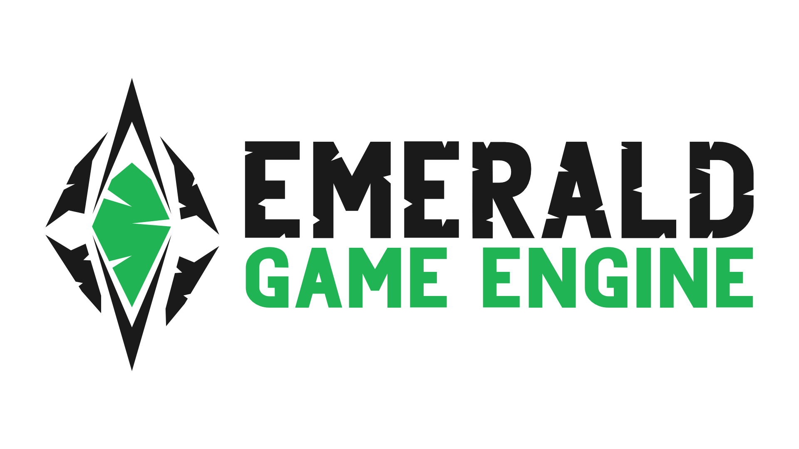

[](https://opensource.org/licenses/MIT)
[](https://crates.io/crates/emerald)
[](https://travis-ci.com/Bombfuse/emerald)

## IN DEVELOPMENT
[x] Sprites

[] Aseprite

[] Logging

[] Tilemaps

[] Fonts

[] Audio

[] WASM/Android


## Lite

A fully featured 2D engine with minimal dependencies.

## Simple, Powerful API

A simple API giving you direct access to physics, audio, and graphics.

Given a handle to the emerald engine, you directly control physics, audio, and the game worlds.

### Asset Loading
```rust
let my_sprite = emd.loader()
    .sprite("./my_assets/my_sprite.png").unwrap();

let my_font = emd.loader()
    .font("./my_assets/my_font.ttf").unwrap();
```

### Physics

```rust
    /// You decide when physics steps!
    /// This makes it very easy to "pause" the game without altering your physics data.

    emd.world().physics().step();
```

### ECS

Emerald uses the [Entity Component System](https://en.wikipedia.org/wiki/Entity_component_system) paradigm for creating, managing, and updating game entities.

Emerald uses [Legion](https://github.com/TomGillen/legion) under the hood for extremely fast entity iteration, and a remarkably clean query API.

```
query example here
```

## [Aseprite](https://www.aseprite.org/)

Emerald has built in aseprite loading and rendering. Simply load in the texture and animation file, then tell it which animations to play.

```
let mut aseprite = emd.loader()
    .aseprite("./assets/my_texture.png", "./assets/my_animation.json").unwrap();

aseprite.play("some_aseprite_animation");

emd.world()
    .insert((), Some((aseprite, Position::zero())));
```


## Portable

Built on top of [miniquad](https://github.com/not-fl3/miniquad) and other cross platform libraries, Emerald is able to run almost anywhere.

* Windows
* MacOS
* Linux
* Android
* Web via WASM

## WASM

### Building

`cargo build --target wasm32-unknown-unknown`

### Asset Loading

Use the `pack_texture` function to load texture data into the engine.

```rust
fn initialize(&mut self, mut emd: Emerald) {
    /// Pack all game files into WASM binary with path references
    /// so that regular file loading API is supported.
    #[cfg(target_arch = "wasm32")]
    {
        emd.loader()
            .pack_texture(
                "./static/assets/bunny.png",
                include_bytes!("../static/assets/bunny.png").to_vec()
            );
    }

    /// We can now load texture/sprites via the normal API,
    /// regardless of which platform we're targeting.
    let sprite = emd.loader()
        .sprite("./static/assets/bunny.png").unwrap();
    
    let mut position = Position::new(0.0, 0.0);

    self.count = 1000;
    emd.world().insert((),
        (0..1000).map(|_| {
            position.x += 6.0;
            position.y += 1.0;
            let mut s = sprite.clone();
            (position.clone(), s, Vel { x: 5.0, y: 3.0 })
        })
    );
}
```


## Demos
* Links
* To
* Hosted
* WASM demos
* with source code