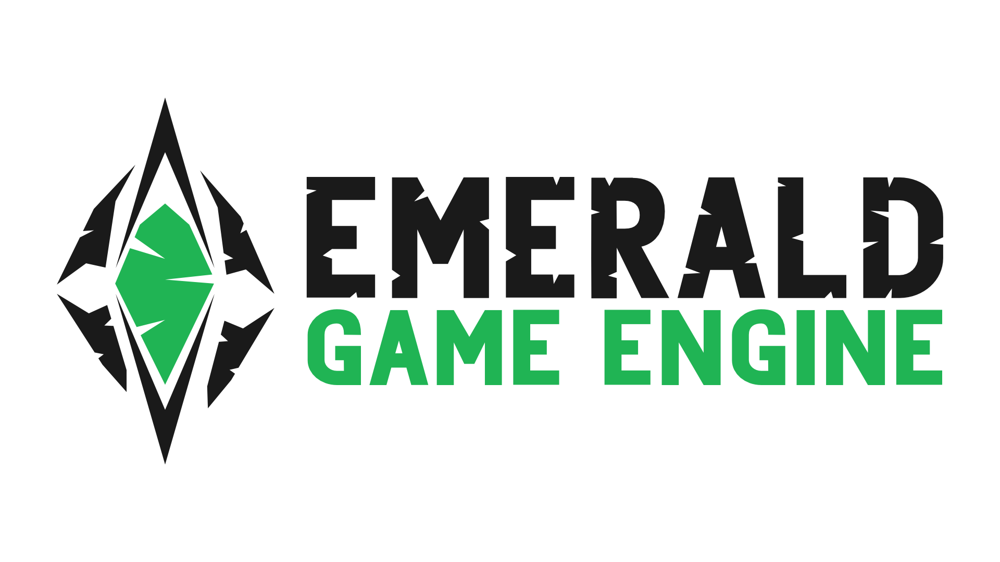
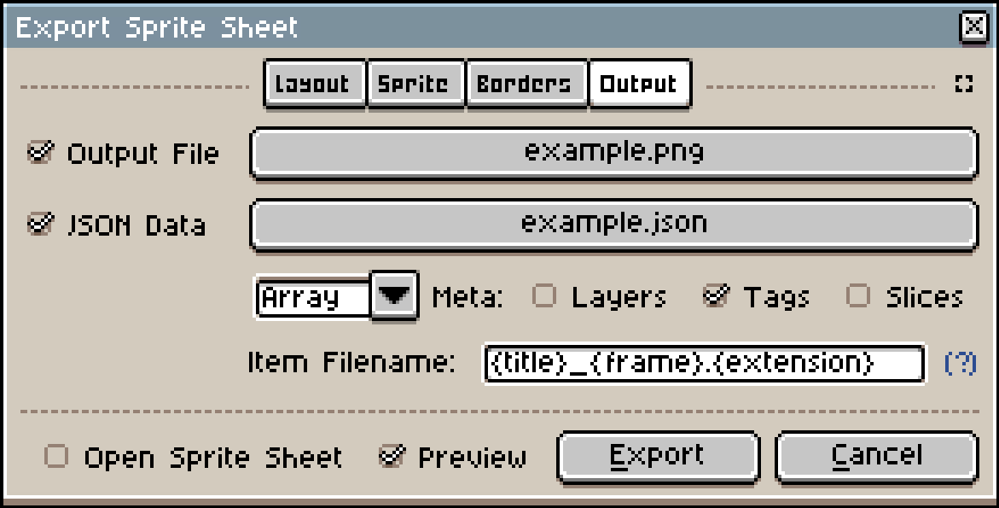

[](https://crates.io/crates/emerald)
[](https://opensource.org/licenses/MIT)
[](https://discord.gg/NHsz38AhkD)


# The Cross Platform Engine

Emerald is designed to be as lightweight as possible, while remaining a fully-featured and cross-platform game engine.

The api is simple and powerful, giving you direct access to physics, audio, graphics, game worlds, and asset loading.

## Supported Platforms
<div>
    
    
    
    
    
    
</div>


--- Work in progress ---
<div>
    
</div>
--------------------------


## Asset Loading
```rust
let my_sprite = emd.loader()
    .sprite("my_sprite.png")
    .unwrap();

let my_audio = emd.loader()
    .sound("my_sound.wav")
    .unwrap();
```


## Physics

### Creating Bodies
```rust
    let entity = emd.world().spawn((Transform::from_translation((0.0, 0.0))));

    let body_handle = emd.world().physics().build_body(
        entity,
        RigidBodyBuilder::dynamic()
    );


    emd.world().physics().build_collider(
        body_handle,
        ColliderDesc::cuboid(6.0, 6.0)
    );

    // You can alternatively build both the entity and body at once.
    let (entity, body_handle) = emd.world()
        .spawn_with_body(
            (Transform::from_translation((0.0, 0.0))),
            RigidBodyBuilder::dynamic()
        )?;
```

### Physics Stepping

```rust

    emd.world()
        .physics()
        .step();
```

You decide when physics steps!
This makes it very easy to "pause" the game without needing to alter any data.

## Graphics

The default method to draw the game is to draw all of the entities in the current world. However, you can write your own `draw` function if you need to do more!

```rust
fn draw(&mut self, mut emd: Emerald) {
    emd.graphics().begin();

    emd.graphics().draw_world();

    emd.graphics().render();
}
```

## Audio
```rust
let my_sound = emd.loader().sound("sounds/my_song.ogg")?;

emd.audio().mixer("background_music")?.play_and_loop(my_sound);
```

## ECS

Emerald uses the [Entity Component System](https://en.wikipedia.org/wiki/Entity_component_system) paradigm for creating, managing, and updating game entities.

Emerald uses [Hecs](https://github.com/Ralith/hecs) under the hood for  fast entity iteration, and a remarkably clean query Api.

More detailed features can be found in the [Hecs documentation](https://docs.rs/hecs/).

```rust
for (id, (sprite, mut position)) in emd.world().query::<(&Sprite, &mut Position)>().iter() {
    position.x += 10.0;
}
```

## [Aseprite](https://www.aseprite.org/)

Emerald has built in aseprite loading and rendering. Simply load in the file, then tell it which animations to play.

```rust
let mut aseprite = emd.loader().aseprite("my_sprite.aseprite").unwrap();

aseprite.play("some_aseprite_animation");

emd.world().spawn((aseprite, Position::zero()));
```

Alternatively, Emerald can load a sprite sheet exported from aseprite.

```rust
let mut aseprite = emd.loader()
    .aseprite_with_animations("my_texture.png", "my_animation.json").unwrap();
```

Export settings



## [WASM](https://webassembly.org/)

### Build

`cargo build --target wasm32-unknown-unknown`

### Asset Loading

In order to keep a clean, simple API, and avoid network requests for assets. Emerald takes the approach of packing all necessary assets into the WASM binary.

This same method can be used to pack all assets into the game binary regardless of which platform you target.

Use the `pack_asset_bytes` function to load data into the engine.

```rust
fn initialize(&mut self, mut emd: Emerald) {
    /// Pack all game files into WASM binary with path references
    /// so that the regular file loading Api is supported.
    #[cfg(target_arch = "wasm32")]
    {
        emd.loader()
            .pack_asset_bytes(
                "bunny.png",
                include_bytes!(".bunny.png").to_vec()
            );
    }

    /// We can now load texture/sprites via the normal Api,
    /// regardless of which platform we're targeting.
    let sprite = emd.loader()
        .sprite("bunny.png")
        .unwrap();
    
    // Default transform at 0.0, 0.0
    let mut transform = Transform::default();

    self.count = 1000;
    emd.world().spawn_batch(
        (0..1000).map(|_| {
            transform.translation.x += 6.0;
            transform.translation.y += 1.0;
            let mut s = sprite.clone();
            (transform.clone(), s, Vel { x: 5.0, y: 3.0 })
        })
    );
}
```

## Android

### Build

Recommended way to build for Android is using Docker.
```bash
docker run --rm -v $(pwd)":/root/src" -w /root/src notfl3/cargo-apk cargo quad-apk build --example physics
```
See [miniquad readme](https://github.com/not-fl3/miniquad#android) and [cargo-quad-apk](https://github.com/not-fl3/cargo-quad-apk) for more details.

### Asset Loading

Add following to `Cargo.toml` and load assets as usual:
```
[package.metadata.android]
assets = "YOUR_ASSETS_DIRECTORY/"
```

## Demos
* Links
* To
* Hosted
* WASM demos
* with source code
